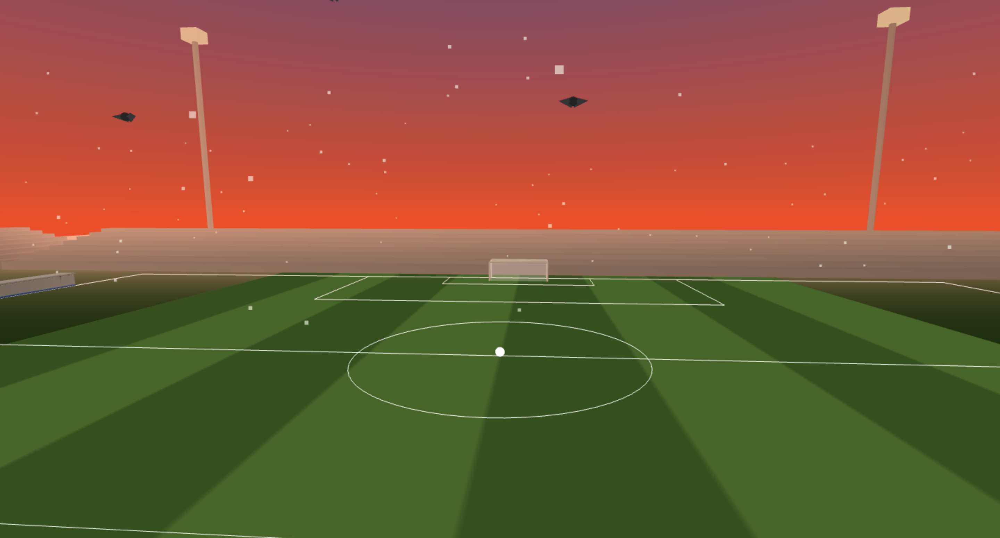

# From Roar to Silence: An Immersive Stadium Experience

*Intense match atmosphere with rain, spotlights, and crowd energy* 

*Peaceful sunrise with birds flying and nature sounds*

## Description

Stadium Atmosphere is an immersive 3D WebGL experience that captures the contrast between the intense energy of a nighttime soccer match and the peaceful stillness of dawn. Built with Three.js and custom GLSL shaders, this project demonstrates advanced computer graphics techniques including:

- **Custom GLSL Shaders**: Sky gradient shader with fragment shader interpolation, animated grass with vertex displacement
- **Dynamic Scene Transitions**: Smooth phase-based transitions between night and dawn atmospheres
- **Particle Systems**: Rain particles for the match scene, breeze particles for dawn, and animated flying birds

## Experience

1. **Static Night Scene** - The experience loads with a frozen nighttime atmosphere

2. **Press Spacebar** - Begins the match with:
   - Crowd noise
   - Heavy rain
   - Camera shake (crowd energy effect)
   - 360° camera rotation begins
   - Stadium spotlights at full intensity

3. **Automatic Transition** - When crowd audio ends:
   - Smooth fade from night to dawn
   - Rain stops
   - Camera shake stops
   - Audio crossfades from crowd to nature sounds
   - Sun rises, stars fade, sky changes color

4. **Dawn Scene** - Peaceful sunrise with:
   - Birds flying across the sky
   - Gentle breeze particles
   - Nature sounds
   - Soft morning lighting

## Performance Notes

- Scene contains ~3,200 particles (rain, breeze, stars)
- Real-time shadow mapping enabled
- 5 animated birds with wing flapping
- Optimized for 60 FPS on modern hardware

## Assets

- Crowd audio: Freesound.org (compressed)
- Nature audio: Freesound.org (compressed)
- Three.js library: three.js.org

## Credits

**Developer**: Mike Emenonye  
**Course**: CS460 - Computer Graphics  
**Institution**: University of Massachusetts Boston  
**Semester**: Fall 2025

